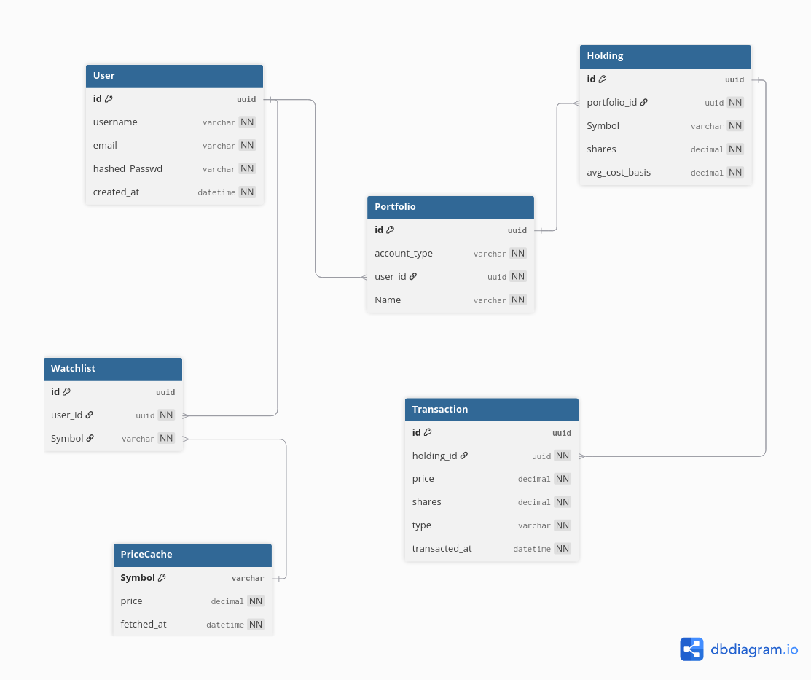

# Portfolio-Tracker

A full-stack portfolio tracking app: a Flask JSON API and a React frontend. Users record buy/sell transactions and see holdings priced against live market data, with cost basis, gain/loss, and allocation calculated per holding and for the portfolio as a whole.

**Live demo:** [https://portfolio-tracker-lemon-sigma.vercel.app]
**API:** [https://portfolio-tracker-actk.onrender.com]

---
## Example

## Features

- Registration, login, JWT access/refresh tokens, logout with token revocation
- Portfolios: create, read, update, delete, scoped per user
- Transactions: buy/sell entries, average cost basis recalculated from full transaction history on each write
- Holdings: shares, average cost basis, live price, market value, gain/loss, allocation %
- Live pricing via the Finnhub API, cached for 15 minutes per symbol
- Price lookup falls back to the last cached price, then to cost basis, if a live lookup fails
- Portfolio-level summary: total value, total cost basis, total gain/loss, gain/loss %
- Demo account seeded with real transactions against live market prices
- Adding a transaction refreshes holdings, summary, and transaction history immediately, no page reload

## Tech Stack

**Backend:** Flask, SQLAlchemy, PostgreSQL, Flask-JWT-Extended, Flask-CORS, Flask-Migrate, Gunicorn
**Frontend:** React (Vite), TanStack Query, Axios, Material UI
**External data:** Finnhub API
**Hosting:** Render (API + PostgreSQL via Aiven), Vercel (frontend)

## Architecture

The backend is a JSON API, paired with a separate React SPA. Routes handle request parsing and response shaping; services (`pricing.py`, `portfolio_service.py`) hold the calculation logic, callable independently of any HTTP request.

On each buy or sell, `get_avg_cost_basis` replays a holding's full transaction history: it sums share count and cost across all past BUY transactions, subtracts out SELL transactions at the average cost in effect at that point, then folds in the new transaction. A BUY changes the average; a SELL reduces share count and leaves the average as-is.

`PriceService.read_price` checks `PriceCache` for the symbol. If the cached row is under 15 minutes old, it's returned directly. Otherwise `add_price` calls Finnhub, updates (or inserts) the cache row, and returns the new price. If that call raises an exception, `read_price` catches it and returns whatever was in the cache, or the holding's `avg_cost_basis` if there's no cached row at all.

Each resource (holdings, transactions, portfolio list) has its own `useQuery` hook in `pricing.js`/`ViewPortfolio.jsx`. `AddTransaction`'s `useMutation` calls `queryClient.invalidateQueries` for the holdings, transactions, and portfolio query keys in its `onSuccess`, so those three refetch as soon as the POST resolves.

# Schema 
 

## Setup

### Backend
```bash
cd backend
python -m venv .venv
source .venv/bin/activate
pip install -r requirements.txt
```

`.env`:
```
SECRET_KEY=...
JWT_SECRET_KEY=...
API_KEY=...          # Finnhub API key
DATABASE_URL=...     # postgresql://...
```

```bash
flask --app run db upgrade
python run.py
```

### Frontend
```bash
cd frontend/frontend-app
npm install
npm run dev
```

Set `baseURL` in `src/api.js` to the backend's address.

### Demo data
```bash
python demo.py
```
Creates a demo user and a portfolio with buy transactions against current prices for a set of common tickers.

## Testing

```bash
cd backend/tests
pytest -v
```

Covers auth, portfolio CRUD, the transaction/cost-basis engine, holdings, and pricing fallback behavior.


## Known Limitations

- Cost basis is a single blended average per holding, not FIFO or lot-based tracking.
- Mutual fund NAV pricing is not supported; Finnhub's free tier covers intraday equity/ETF quotes.

## Roadmap

- Watchlist
- Transaction editing/deletion
- Gain/loss chart

